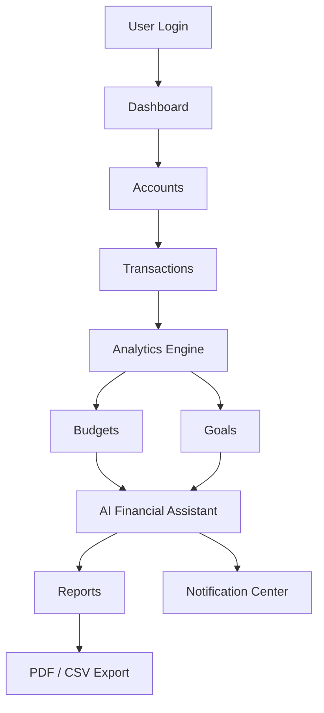

# FLOPs - Financial Lifestyle Optimization Suite


**FLOPs** is an AI-powered personal finance management platform that helps users take control of their financial lives through intelligent budgeting, expense tracking, financial analytics, AI-driven insights, and goal planning.

# 🌟 Overview
Built with a modern full-stack architecture, FLOPs combines intuitive financial management tools with AI to provide personalized recommendations, automated reports, and actionable financial insights—all in one unified platform.

From managing daily expenses to tracking long-term savings goals, FLOPs transforms financial data into meaningful insights through interactive dashboards, smart notifications, AI assistance, and detailed reports.

# 📉 Problem Statement

Managing personal finances can quickly become overwhelming. Users often struggle to:

- Track income and expenses efficiently
- Stay within monthly budgets
- Monitor savings goals
- Understand their spending habits
- Generate financial reports
- Receive personalized financial guidance

Most traditional finance trackers only record transactions—they don't help users make smarter financial decisions.

# ✨ The Solution

FLOPs combines financial management with AI to create a complete personal finance platform.

Users can:

- Track income and expenses
- Manage multiple financial accounts
- Create category-based budgets
- Set financial goals
- Analyze spending through interactive charts
- Receive AI-powered financial recommendations
- Export professional financial reports
- Get intelligent notifications about budgets, goals, and financial health

Everything is centralized into a single intelligent dashboard.

# 🛠 Key Features

### 💰 Financial Management
- Multi-account management
- Income & expense tracking
- Transaction history
- Category management

### 📊 Analytics Dashboard
- Interactive financial dashboard
- Pie chart visualizations
- Weekly trends
- Monthly trends
- Yearly analytics
- Financial health score

### 🎯 Budget Management
- Monthly budgets
- Budget utilization tracking
- Remaining balance
- Overspending alerts

### 🎯 Goal Planning
- Financial goals
- Savings tracking
- Progress visualization
- Goal completion estimates

### 🤖 AI Financial Assistant
- Personalized financial advice
- Spending analysis
- Budget recommendations
- Savings suggestions
- AI-generated financial summaries

### 📄 Smart Reports
- AI Executive Summary
- PDF Export
- CSV Export
- Financial Snapshot
- Goal & Budget Reports

### 🔔 Notification Center
- Budget alerts
- Goal reminders
- Report notifications
- Financial health updates
- AI insight notifications

### 👤 User Management
- Google Authentication
- Profile management
- Preferences
- Security settings

# ⚙️ How It Works



Users securely sign in. Financial accounts are created. Income and expenses are recorded. Analytics update automatically. AI analyzes spending behavior. Personalized recommendations are generated. Reports and notifications help users stay financially organized.

# 🤖 AI Features

FLOPs integrates Groq LLM to provide intelligent financial assistance.

The AI analyzes:
- Accounts
- Transactions
- Budgets
- Goals
- Spending patterns
- Financial health

It then generates:
- Spending analysis
- Budget suggestions
- Savings strategies
- Personalized recommendations
- Executive financial summaries

# 🏗 System Architecture

The application follows a modern full-stack architecture.

- **Frontend:** Next.js, React, TypeScript, Tailwind CSS, Framer Motion
- **Backend:** Next.js API Routes (Repository-Service Architecture)
- **Database:** MongoDB, Prisma ORM
- **Authentication:** NextAuth.js, Google OAuth
- **AI:** Groq API

# 🧰 Tech Stack

| Category | Technologies |
| :--- | :--- |
| **Frontend** | Next.js, React, TypeScript |
| **Styling** | Tailwind CSS, Framer Motion |
| **Backend** | Next.js API Routes |
| **Database** | MongoDB, Prisma |
| **Authentication** | NextAuth.js, Google OAuth |
| **AI** | Groq LLM |
| **Charts** | Recharts |
| **PDF** | jsPDF |
| **CSV** | Custom CSV Generator |

# 📂 Project Structure

```text
flops/
├── app/                          # Next.js App Router
│   ├── accounts/                 # Accounts management pages
│   ├── ai-insights/             # AI insights interface
│   ├── api/                     # API routes
│   │   ├── accounts/            # Account endpoints
│   │   ├── ai/                  # AI endpoints
│   │   ├── analytics/           # Analytics endpoints
│   │   ├── auth/                # Authentication endpoints
│   │   ├── budgets/             # Budget endpoints
│   │   ├── export/              # Export endpoints
│   │   ├── goals/               # Goals endpoints
│   │   ├── notifications/       # Notification endpoints
│   │   ├── profile/             # Profile endpoints
│   │   ├── reports/             # Reports endpoints
│   │   ├── testimonials/        # Testimonials endpoints
│   │   └── transactions/        # Transaction endpoints
│   ├── auth/                    # Auth pages (login, signup, forgot-password)
│   ├── budget/                  # Budget management pages
│   ├── goals/                   # Goals tracking pages
│   ├── overview/                # Dashboard overview
│   ├── profile/                 # User profile pages
│   ├── reports/                 # Reports pages
│   ├── transactions/            # Transaction pages
│   ├── globals.css              # Global styles
│   ├── layout.tsx               # Root layout
│   └── page.tsx                 # Landing page
│
├── components/                   # React components
│   ├── accounts/                # Account-related components
│   ├── ai-insights/            # AI insight components
│   ├── budget/                  # Budget components
│   ├── common/                  # Shared components
│   ├── dashboard/               # Dashboard components
│   ├── goals/                   # Goal components
│   ├── layouts/                 # Layout components
│   ├── notifications/           # Notification components
│   ├── profile/                 # Profile components
│   ├── providers/               # Context providers
│   ├── transactions/            # Transaction components
│   └── ui/                      # UI primitives
│
├── features/                     # Feature modules (Domain-driven)
│   ├── accounts/                # Account domain logic
│   │   ├── repositories/        # Data access layer
│   │   ├── schemas/             # Validation schemas
│   │   ├── services/            # Business logic
│   │   └── types/               # Type definitions
│   ├── ai/                      # AI domain logic
│   │   ├── dto/                 # Data transfer objects
│   │   ├── parsers/             # Response parsers
│   │   ├── prompt-builders/     # Prompt templates
│   │   ├── providers/           # AI providers
│   │   ├── services/            # AI services
│   │   └── types/               # Type definitions
│   ├── analytics/               # Analytics domain
│   │   ├── calculators/         # Calculation logic
│   │   ├── dto/                 # Data transfer objects
│   │   ├── mappers/             # Data mappers
│   │   ├── repositories/        # Data access
│   │   ├── services/            # Analytics services
│   │   └── types/               # Type definitions
│   ├── budget/                  # Budget domain
│   │   ├── calculators/         # Budget calculations
│   │   ├── dto/                 # Data transfer objects
│   │   ├── engine/              # Budget engine
│   │   ├── mappers/             # Data mappers
│   │   ├── repositories/        # Data access
│   │   ├── schemas/             # Validation schemas
│   │   ├── services/            # Budget services
│   │   └── types/               # Type definitions
│   ├── exports/                 # Export domain
│   │   └── services/            # Export services
│   ├── goals/                   # Goals domain
│   │   ├── calculators/         # Goal calculations
│   │   ├── dto/                 # Data transfer objects
│   │   ├── engine/              # Goals engine
│   │   ├── mappers/             # Data mappers
│   │   ├── repositories/        # Data access
│   │   ├── schemas/             # Validation schemas
│   │   ├── services/            # Goal services
│   │   └── types/               # Type definitions
│   ├── notifications/           # Notifications domain
│   │   ├── dto/                 # Data transfer objects
│   │   ├── engine/              # Notification engine
│   │   ├── generators/          # Notification generators
│   │   ├── repositories/        # Data access
│   │   ├── schemas/             # Validation schemas
│   │   ├── services/            # Notification services
│   │   └── types/               # Type definitions
│   ├── profile/                 # Profile domain
│   │   ├── dto/                 # Data transfer objects
│   │   ├── repositories/        # Data access
│   │   ├── services/            # Profile services
│   │   └── types/               # Type definitions
│   ├── reports/                 # Reports domain
│   │   ├── dto/                 # Data transfer objects
│   │   ├── engine/              # Report engine
│   │   ├── generators/          # Report generators
│   │   ├── repositories/        # Data access
│   │   ├── schemas/             # Validation schemas
│   │   ├── services/            # Report services
│   │   └── types/               # Type definitions
│   └── transactions/            # Transactions domain
│       ├── repositories/        # Data access
│       ├── schemas/             # Validation schemas
│       ├── services/            # Transaction services
│       └── types/               # Type definitions
│
├── lib/                         # Core utilities
│   ├── models/                  # MongoDB models
│   ├── schemas/                 # Shared schemas
│   ├── auth.ts                  # Auth configuration
│   ├── logger.ts                # Logging utilities
│   ├── mongodb.ts               # MongoDB connection
│   └── utils.ts                 # Utility functions
│
├── tests/                       # Test suites
│   ├── e2e/                     # End-to-end tests
│   │   ├── accounts/            # Account E2E tests
│   │   ├── ai/                  # AI E2E tests
│   │   ├── auth/                # Auth E2E tests
│   │   ├── budget/              # Budget E2E tests
│   │   ├── goals/               # Goals E2E tests
│   │   ├── notifications/       # Notification E2E tests
│   │   ├── profile/             # Profile E2E tests
│   │   ├── reports/             # Reports E2E tests
│   │   ├── responsive/          # Responsive tests
│   │   ├── transactions/        # Transaction E2E tests
│   │   └── workflow/            # Workflow tests
│   ├── integration/             # Integration tests
│   │   ├── accounts/            # Account integration tests
│   │   ├── ai/                  # AI integration tests
│   │   ├── analytics/           # Analytics integration tests
│   │   ├── api/                 # API integration tests
│   │   ├── auth/                # Auth integration tests
│   │   ├── budgets/             # Budget integration tests
│   │   ├── cache/               # Cache integration tests
│   │   ├── db/                  # Database integration tests
│   │   ├── engines/             # Engine integration tests
│   │   ├── goals/               # Goals integration tests
│   │   ├── notifications/       # Notification integration tests
│   │   ├── reports/             # Reports integration tests
│   │   └── transactions/        # Transaction integration tests
│   ├── unit/                    # Unit tests
│   │   ├── ai/                  # AI unit tests
│   │   ├── analytics/           # Analytics unit tests
│   │   ├── budget/              # Budget unit tests
│   │   ├── goals/               # Goals unit tests
│   │   ├── ledger/              # Ledger unit tests
│   │   ├── notifications/       # Notification unit tests
│   │   ├── reports/             # Reports unit tests
│   │   └── utils/               # Utility unit tests
│   ├── fixtures/                # Test fixtures
│   ├── helpers/                 # Test helpers
│   ├── mocks/                   # Mock data
│   └── setup/                   # Test setup
│
├── public/                      # Static assets
│   ├── images/                  # Image assets
│   └── icons/                   # Icon assets
│
├── types/                       # TypeScript type definitions
│   └── next-auth.d.ts          # NextAuth type extensions
│
├── coverage/                    # Test coverage reports
├── .next/                       # Next.js build output
├── node_modules/                # Dependencies
├── .env.example                 # Environment variables example
├── .env.local                   # Local environment variables
├── .gitignore                   # Git ignore rules
├── auth.config.ts               # NextAuth configuration
├── components.json              # Component configuration
├── eslint.config.mjs            # ESLint configuration
├── next.config.js               # Next.js configuration
├── package.json                 # Project dependencies
├── playwright.config.ts         # Playwright configuration
├── postcss.config.mjs           # PostCSS configuration
├── README.md                    # Project documentation
├── tsconfig.json                # TypeScript configuration
└── vitest.config.ts             # Vitest configuration
```

# 🚀 Installation

### 1. Clone Repository
```bash
git clone https://github.com/BikramMondal5/FLOPs
cd flops
```

### 2. Install Dependencies
```bash
npm install
```

### 3. Configure Environment
Create a `.env` file in the root directory:
```env
DATABASE_URL=
NEXTAUTH_URL=
NEXTAUTH_SECRET=
GOOGLE_CLIENT_ID=
GOOGLE_CLIENT_SECRET=
GROQ_API_KEY=
```

### 4. Run Development Server
```bash
npm run dev
```

---

# 🔐 Environment Variables

| Variable | Description |
| :--- | :--- |
| `DATABASE_URL` | MongoDB Connection String |
| `NEXTAUTH_SECRET` | NextAuth Secret |
| `NEXTAUTH_URL` | Application URL |
| `GOOGLE_CLIENT_ID` | Google OAuth Client ID |
| `GOOGLE_CLIENT_SECRET` | Google OAuth Client Secret |
| `GROQ_API_KEY` | Groq API Key |

# 🚀 Future Enhancements

- 🔍 OCR Receipt Scanner
- 📈 Investment Portfolio Tracking
- ⏰ Bill Reminder Automation
- 💱 Multi-currency Support
- 🎙️ Voice Financial Assistant
- 🔮 Predictive Expense Forecasting
- 📱 Mobile Application
- 💬 AI Chat History
- 🏦 Bank API Integration

# 📄 License

This project is licensed under the `Apache-2.0 license`.

---

⭐ If you like this project, consider giving it a Star on GitHub!